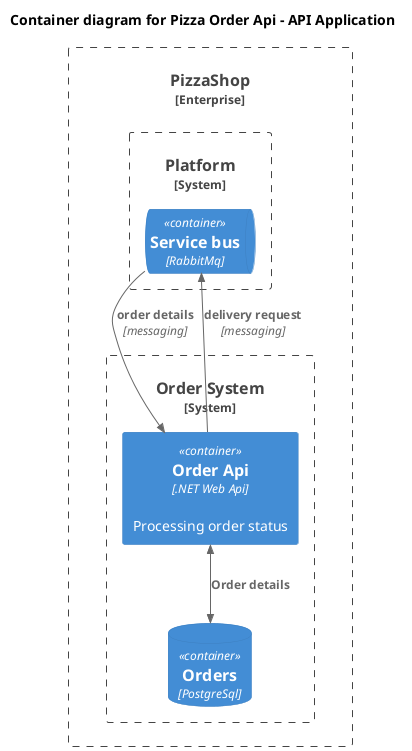

```plantuml
@startuml container diagram
!include <C4/C4_Container.puml>
title Container diagram for Pizza Order Api - API Application

Enterprise_Boundary(pizzaEnterprise, "PizzaShop") {

  System_Boundary(platform, "Platform") {
    ContainerQueue(serviceBus, "Service bus", "RabbitMq")
  }

  System_Boundary(orderSystem, "Order System") {
    Container(orderApi, "Order Api", ".NET Web Api", "Processing order status")
    ContainerDb(orderDb, "Orders", "PostgreSql")

    BiRel(orderApi, orderDb, "Order details")
  }

  Rel(serviceBus, orderApi, "order details", "messaging")
  Rel(orderApi, serviceBus, "delivery request", "messaging")
}
@enduml
```
