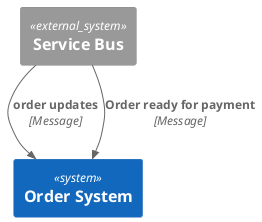

```plantuml
@startuml
!include <C4/C4_Context.puml>

System_Ext(serviceBus, "Service Bus")
System(orderSystem, "Order System")

Rel(serviceBus, orderSystem, "order updates", "Message")
Rel_Back(orderSystem, serviceBus, "Order ready for payment", "Message")
@enduml
```
