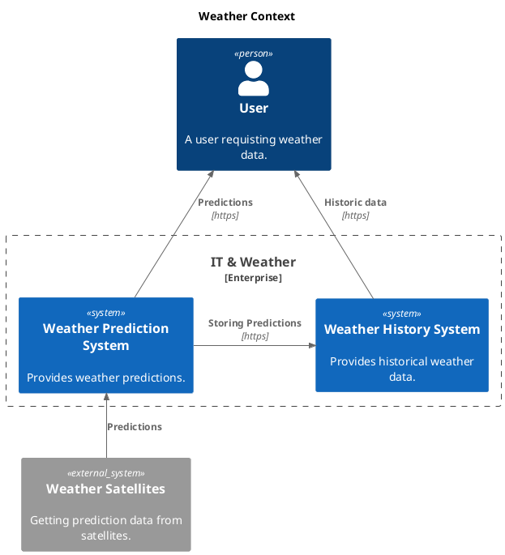

# Overview

```plantuml
@startuml
!include <C4/C4_Context.puml>

title Weather Context

Person(user, "User", "A user requisting weather data.")

Enterprise_Boundary(c0, "IT & Weather") {
    System(weather_prediction, "Weather Prediction System", "Provides weather predictions.")
    System(weather_history, "Weather History System", "Provides historical weather data.")
}

System_Ext(satellite, "Weather Satellites", "Getting prediction data from satellites.")

Rel_Up(satellite, weather_prediction, "Predictions", "")
Rel_Back(user, weather_prediction, "Predictions", "https")
Rel_Back(user, weather_history, "Historic data", "https")
Rel_R(weather_prediction, weather_history, "Storing Predictions", "https")

@enduml
```
